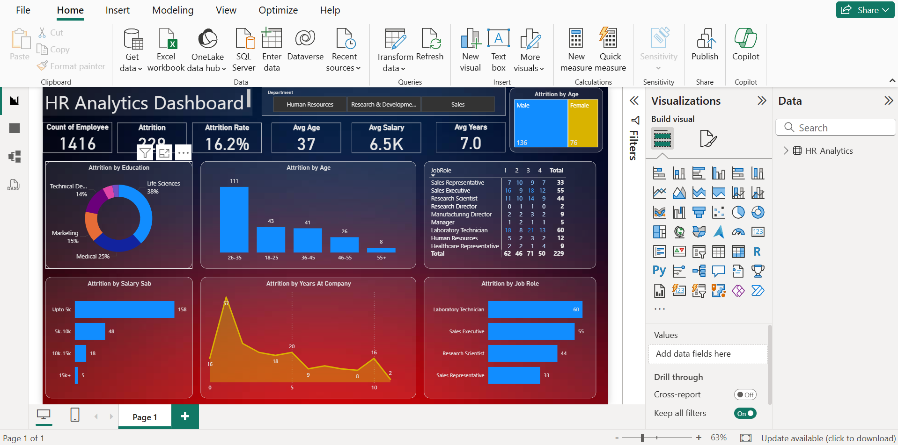

# 📊 HR Analytics Dashboard — Power BI

An interactive HR Analytics Dashboard built using **Power BI Desktop**, designed to help HR teams analyze employee attrition, performance, and workforce trends to make data-driven decisions.

---

## 🖼️ Dashboard Preview

---

## 📌 Project Overview

Employee attrition is one of the biggest challenges for organizations. This dashboard provides a comprehensive view of attrition patterns across multiple dimensions — helping HR managers identify high-risk groups and take proactive action.

---

## 🎯 Key Metrics Tracked

| Metric | Value |
|---|---|
| Total Employees | 1,416 |
| Total Attrition | 229 |
| Attrition Rate | 16.2% |
| Average Age | 37 |
| Average Salary | 6.5K |
| Average Years at Company | 7.0 |

---

## 📊 Dashboard Features

### 1. Attrition by Education
- Identifies which educational backgrounds have the highest attrition
- Life Sciences (38%), Medical (25%), Marketing (15%), Technical (14%)

### 2. Attrition by Age Group
- Bar chart showing attrition across age bands
- Highest attrition in the **26–35** age group (111 employees)

### 3. Attrition by Salary Slab
- Employees earning **up to 5K** have the highest attrition (158)
- Clear correlation between low salary and high attrition

### 4. Attrition by Years at Company
- Line chart showing attrition trends over tenure
- Peaks visible at early tenure (0–2 years)

### 5. Attrition by Job Role
- Matrix table breaking down attrition by job role across satisfaction levels
- Laboratory Technicians (60) and Sales Executives (55) show highest attrition

### 6. Attrition by Gender
- Male: 136 | Female: 76

### 7. Department Filter
- Interactive filter for Human Resources, Research & Development, Sales

---

## 💡 Key Insights

- **Low salary is the #1 driver** of attrition — employees earning under 5K leave the most
- **Early career employees (26–35)** are the most at-risk group
- **Life Sciences graduates** have the highest attrition by education background
- **Laboratory Technicians and Sales Executives** need targeted retention strategies
- Attrition spikes in the **first 2 years** — onboarding and engagement programs needed

---

## 🛠️ Tools & Technologies

- **Power BI Desktop** — Dashboard design and visualizations
- **Microsoft Excel** — Data source and preprocessing
- **DAX (Data Analysis Expressions)** — Custom measures and calculations

---

## 📁 Files in This Repository

| File | Description |
|---|---|
| `HR_Analytics.pbix` | Power BI dashboard file |
| `screenshot.png` | Dashboard preview image |
| `HR_Analytics.csv` | Source dataset (if applicable) |

---

## 🚀 How to View the Dashboard

1. Download and install **[Power BI Desktop](https://powerbi.microsoft.com/desktop/)** (free)
2. Clone or download this repository
3. Open `HR_Analytics.pbix` in Power BI Desktop
4. Explore the interactive dashboard!

---

## 👨‍💻 About Me

**Naveen G Patil**
MCA Graduate | Chandigarh University
📧 naveengpatil08@gmail.com
🔗 [LinkedIn](https://linkedin.com/in/naveengpatil)
💻 [GitHub](https://github.com/naveengpatil08)

---

## 📜 License

This project is open source and available for educational purposes.
